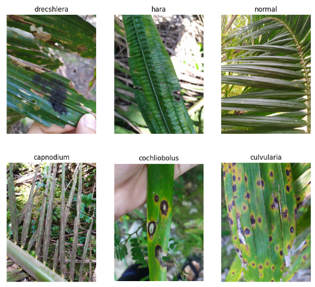

# SawitHub - Machine Learning Part

## Table of Contents📃
- [SawitHub - Machine Learning Part](#sawithub---machine-learning-part)
  - [Table of Contents📃](#table-of-contents)
  - [Project Background🤔](#project-background)
  - [SawitHub Apps📱](#sawithub-apps)
  - [Machine Learning Part in SawitHub🤖](#machine-learning-part-in-sawithub)
  - [Dataset🌴](#dataset)
  - [Data Understanding and Preprocessing🔍](#data-understanding-and-preprocessing)
  - [Modeling📉📈](#modeling)
  - [Further Improvement✍🏽](#further-improvement)
  - [Contributors👁️👄👁️](#contributors️️)

## Project Background🤔
Indonesia is the world's largest producer of palm oil, and many farmers rely on palm oil plantations. However, palm oil farmers face problems, like late detection of pests and diseases in their plantations  can spread and contaminate other palm oil trees. This causes a decrease in harvest yields and poor quality of the fruit bunches, ultimately leading to losses for the farmers. Palm oil plantation productivity also decreases the result.
From this, we have identified several problem formulations, including:
How can technology help palm oil farmers overcome these issues?
How can palm oil farmers utilize technology to their advantage?

## SawitHub Apps📱

Based on the previously mentioned problem, we have developed SawitHub. SawitHub is an Android application with the main feature of detecting diseases in oil palms. We also plan to incorporate additional features into the application, including consultations with palm oil experts, acting as an intermediary for the sale of products from palm plantations, and providing recommendations for related products for oil palm plantation care.

## Machine Learning Part in SawitHub🤖
The main feature of SawitHub is to perform oil palm disease detection through images, starting with the leaves. This feature requires the implementation of machine learning to be realized. We have built an artificial neural network, specifically a CNN, capable of performing this task (computer vision).

## Dataset🌴

In this repository, we have created two models from different datasets. Both datasets contain images of oil palm leaves with their corresponding disease labels. Dataset 1 consists of 6 classes (developed in the "6 class classification" folder), while dataset 2 consists of 3 classes (developed in the "3 class classification" folder).
Dataset 1 was obtained from the research paper titled ["Machine Learning for Detection of Palm Oil Leaf Disease Visually using Convolutional Neural Network Algorithm"](https://ojs.uma.ac.id/index.php/jite/article/view/4185). Dataset 2 was obtained from [Kaggle](https://www.kaggle.com/datasets/hadjerhamaidi/date-palm-data).

## Data Understanding and Preprocessing🔍
We have utilized two different datasets and selected the best-performing model from each dataset. These models, referred to as Model 1 and Model 2, will be compared to determine the superior one. Dataset 1 consists of 6 classes, with each class containing 10 images of oil palm leaves. Here are example images from each class:

     

Dataset 1 has a very limited amount of data for training the CNN. To overcome this limitation, we have implemented an augmentation strategy. The data is split into two sets: a test set (40%) and a train-validation set (60%). Image augmentation is applied to the train-validation set using the `tensorflow.keras.preprocessing.image.ImageDataGenerator` module. Here are examples of the original images and the augmented images:

     

Dataset 2 consists of 3 classes, with each class containing a varying number of oil palm leaf images, ranging from 376 to 962. Here are example images from each class:

     

Dataset 2 has a sufficient amount of data to train the CNN compared to Dataset 1. However, there is an imbalance in the number of data samples per class. To address this issue, we have decided to perform oversampling. The data is split into two sets: a test set (20%) and a train-validation set (80%). Oversampling is applied to the train-validation set to balance the number of data samples per class. By applying oversampling, the data imbalance issue is mitigated, and each class in the train-validation set has a balanced number of data samples.

## Modeling📉📈
To build a robust CNN architecture, we have decided to implement transfer learning using a pre-trained MobileNet model. Custom layers are added below the base model. Here are the custom layers for each model (Model 1 and Model 2):

     

Training was only conducted on the custom layers, while the base model was frozen. After tuning hyperparameters such as architecture, epochs, optimizer, batch size, and other parameters, we obtained two models that we believed worked optimally with the available data.
Model 1 experienced significant overfitting despite applying image augmentation to the data. Here is a summary of the training and evaluation process we conducted.

     

     

|  |Precision  | Recall| F1-Score| Support| 
--- | --- | ---| ---| ---|
| | | | | | |
|0 |1.00|0.50|0.67|4|
|1 |0.50|0.25|0.33|4|
|2 |0.38|0.75|0.50|4|
|3 |0.67|1.00|0.80|4|
|4 |1.00|0.50|0.67|4|
|5 |0.50|0.50|0.50|4|
|Accuracy | | |0.58|24|
|Macro AVG |0.67|0.58|0.58|24|
|Weighted AVG |0.67|0.58|0.58|24|

Model 2 provided satisfactory results, without experiencing overfitting or underfitting. Model 2 achieved an F1-score of 0.97 without oversampling. Therefore, we chose to train the model using data without oversampling. Here is a summary of the training and evaluation process we conducted.

     

     

|  |Precision  | Recall| F1-Score| Support| 
--- | --- | ---| ---| ---|
| | | | | | |
|0 |1.00|0.99|0.99|94|
|1 |1.00|0.94|0.97|241|
|2 |0.92|1.00|0.96|291|
|Accuracy | | |0.97|527|
|Macro AVG |0.97|0.98|0.97|527|
|Weighted AVG |0.97|0.97|0.97|527|

Out of the two models generated, we have chosen to use Model 2 in the SawitHub application. Model 2 is saved in a `.tflite` file and will be integrated into the application.

## Further Improvement✍🏽

From the generated model, we plan to improve its performance and functionality by adding more data, modifying the architecture, and changing the preprocessing scheme. We aim to create a model that can accurately classify various oil palm diseases through leaf images.

In the SawitHub application, we also intend to develop another model so that palm disease detection is not limited to leaf images. The planned model will be capable of classifying diseases based on fruit and trunk images of oil palm trees.

Furthermore, we aspire to develop a model for large-scale classification of oil palm diseases, utilizing images from drones or satellites, for integration into SawitHub.

## Contributors👁️👄👁️

- M251DKX3882 [Muthaqin Dean](https://github.com/qiqin "Muthaqin Dean") 
- M151DSX1324  [Yusrian Asghany](https://github.com/yusrianasghany "Yusrian Asghany")
